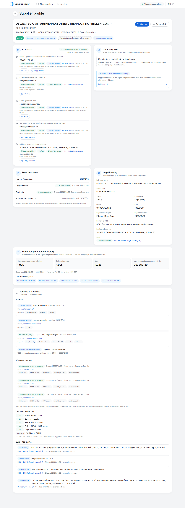
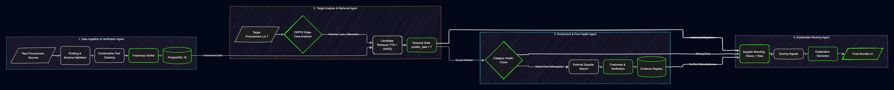
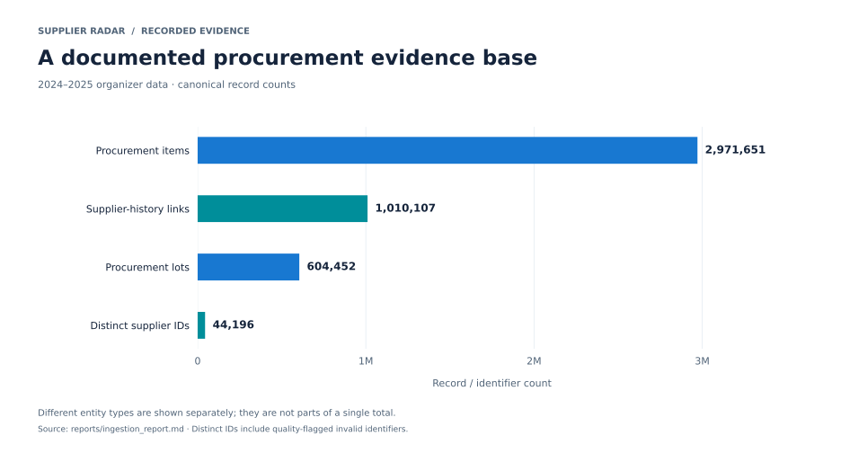
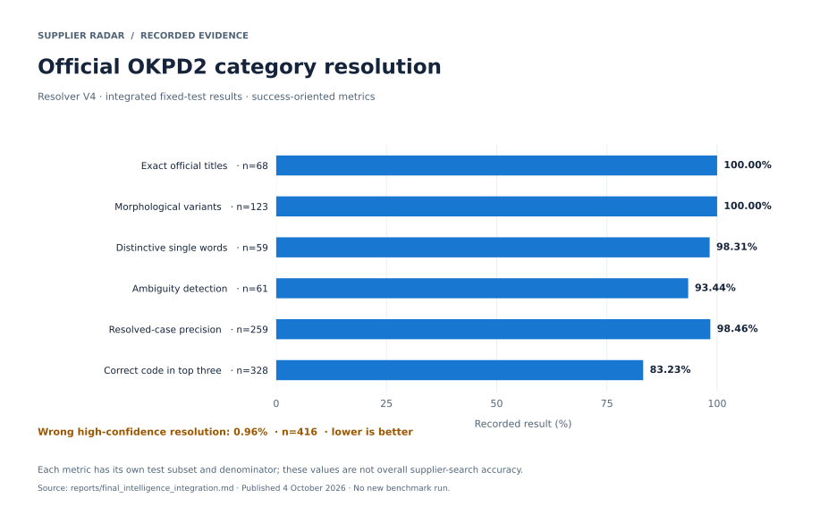
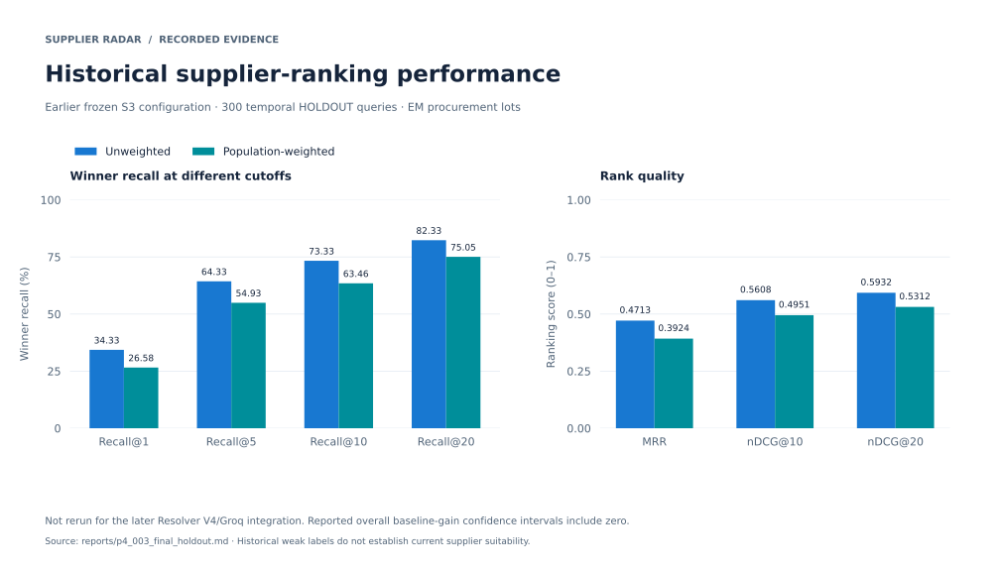

<p align="center">
  <picture>
    <source media="(prefers-color-scheme: dark)" srcset="frontend/public/brand/logo-light.svg">
    <source media="(prefers-color-scheme: light)" srcset="frontend/public/brand/logo.svg">
    
  </picture>
</p>

<h1 align="center">Supplier Radar</h1>
<p align="center"><strong>Evidence-based supplier discovery for public procurement</strong></p>
<p align="center">Describe a product. Review its official category. Compare suppliers with traceable evidence.</p>

<p align="center">
  
  
  
  
</p>

<p align="center">
  <a href="#product-preview">Preview</a> ·
  <a href="#how-it-works">Architecture</a> ·
  <a href="#quick-start">Quick Start</a> ·
  <a href="#data">Data</a> ·
  <a href="#validated-results">Results</a> ·
  <a href="#api">API</a> ·
  <a href="#documentation">Documentation</a>
</p>

---

**Supplier Radar** helps procurement teams discover potential suppliers from historical procurement records, interpret Russian OKPD2 product categories, and inspect company profiles with source-backed identity and contact information. Developed for **RLT.Hack 2026** by **RoboxTeam**.

**Current implementation:** the Supplier 360, contact-discovery, Resolver V4, and optional Groq integration was validated on **2 October 2026** and merged into `main` on **4 October 2026**. See the [integration report](reports/final_intelligence_integration.md) for the tested commits, measurements, and limitations.

## Highlights

- **Search in plain language:** describe a product or service and inspect ranked historical suppliers with reasons for each match.
- **Review official categories:** Resolver V4 combines the complete OKPD2 taxonomy, Russian morphology, term specificity, historical support, and supporting semantic evidence.
- **Keep uncertainty visible:** resolved, ambiguous, and uncertain categories lead to distinct UI states; users can select an official candidate when clarification is needed.
- **Inspect Supplier 360:** legal identity, EGRUL sources, OGRN/KPP, OKVED, procurement history, and contact provenance in one profile.
- **Understand the supplier pool:** concentration signals, historical alternatives, and curated external leads support further market research.
- **Export findings:** JSON and CSV exports provide evidence-bearing search results for downstream workflows.

The optional LLM verifier selects only from official candidates supplied by the deterministic resolver. It cannot introduce a new category code, and failures preserve the deterministic result.

## Product preview



*Recorded English Supplier 360 interface. Contact values carry source and freshness information; coverage depends on available evidence.*

With the documented data loaded, open `/ru/search` or `/en/search`, describe a product, review the proposed category, and open a supplier profile. An ambiguous result asks for category selection before treating category-specific matches as confirmed.

## How it works



| Stage | Responsibility |
| --- | --- |
| Ingest | Verify organizer CSVs, normalize records, preserve raw provenance, and reconcile canonical tables. |
| Resolve | Match the query to official OKPD2 candidates and report resolution or uncertainty. |
| Retrieve and rank | Combine lexical, technical-token, OKPD2, and semantic retrieval with historical evidence. |
| Enrich | Reconcile company identity and attach independently checked role and contact evidence. |
| Present | Explain matches, expose pool-health signals, display freshness, and export results. |

A historical match, a verified contact, and a manufacturer role are separate evidence claims. Resolver scores are evidence-strength values, not calibrated probabilities.

## Technology

| Layer | Implementation |
| --- | --- |
| Interface | Next.js 16, React 19, TypeScript 5.9, Tailwind CSS 4, `next-intl` |
| API | Python 3.11, FastAPI, Pydantic, Uvicorn |
| Storage | PostgreSQL 16, pgvector/HNSW, `pg_trgm`, Alembic |
| Language and retrieval | `pymorphy3` 2.0.6, Russian full-text search, IDF, pinned `intfloat/multilingual-e5-small` embeddings |
| Optional verification | OpenAI-compatible Groq API; configured model `qwen/qwen3.8-27b` |
| Local runtime | Docker Compose for PostgreSQL/API and tools; a separate Next.js server for the UI |

Dependency versions and the embedding revision are recorded in [`frontend/package-lock.json`](frontend/package-lock.json), [`backend/requirements.txt`](backend/requirements.txt), and [`backend/semantic_model.lock.json`](backend/semantic_model.lock.json).

## Quick start

Commands below use a Bash-compatible shell and run from the repository root unless stated otherwise. You need Docker with Compose v2 and **Node.js 20.9 or newer**, as required by the committed Next.js dependency. Initial builds and the one-time model download need network access. The PostgreSQL Compose configuration uses a 4 GiB shared-memory segment and 1 GiB maintenance-work-memory setting; allow sufficient Docker memory and disk capacity for the database and indexes.

### 1. Get the repository

```bash
git clone https://github.com/alfalahnaif/RLT.Hack-RoboxTeam.git
cd RLT.Hack-RoboxTeam
cp .env.example .env
```

For an existing database volume, retain the credentials used when that volume was created. Configure `.env` for a new installation and keep credentials outside Git.

### 2. Choose your starting point

**Existing populated database and model volume**

```bash
docker compose up -d --build
docker compose run --rm backend python -m app.cli ingest-status
```

Continue to step 3. If the pinned model or semantic index is missing, use the corresponding preparation commands below.

**New installation**

Place the three organizer files listed in [Data](#data) in `data/raw/`. They are required for historical supplier search and are not included in Git.

```bash
# Start PostgreSQL and apply the schema migrations.
docker compose up -d postgres
docker compose run --rm backend alembic upgrade head

# Load and reconcile the organizer records.
docker compose run --rm backend python -m app.cli ingest organizer /data/raw
docker compose run --rm backend python -m app.cli ingest-status

# Prepare lexical statistics and the pinned semantic model/index.
docker compose run --rm backend python -m app.cli search build-stats
docker compose run --rm backend python -m app.cli semantic download-model
docker compose run --rm backend python -m app.cli semantic build

# Start the product API after preparation.
docker compose up -d --build api
```

Ingestion and the full semantic build process millions of records and are preparation jobs. API startup applies migrations but does not ingest CSVs or rebuild embeddings. Initial historical ingestion also does not populate every supplier's external profile; enrichment is a separate operation.

### 3. Start the interface

In a second terminal, from the repository root:

```bash
cd frontend
npm ci
npm run dev
```

| Service | Local address |
| --- | --- |
| Russian search | http://localhost:3000/ru/search |
| English search | http://localhost:3000/en/search |
| API health | http://localhost:8000/api/v1/health |
| OpenAPI documentation | http://localhost:8000/docs |

The committed frontend development configuration uses `NEXT_PUBLIC_API_MODE=live` and `NEXT_PUBLIC_API_BASE_URL=http://localhost:8000/api/v1`. Review local overrides if the interface shows synthetic data or points to another API.

For a UI-only preview without organizer data, run `NEXT_PUBLIC_API_MODE=mock npm run dev` in `frontend/`. This preview uses synthetic fixtures and does not demonstrate live supplier discovery.

### 4. Check readiness and try a query

```bash
curl http://localhost:8000/api/v1/health

curl -X POST http://localhost:8000/api/v1/supplier-search \
  -H 'Content-Type: application/json' \
  -d '{"query":"Принтеры","limit":5}'
```

A fully prepared stack reports `status: "ok"`, semantic readiness, and a ready evidence catalog. Missing semantic prerequisites result in degraded retrieval; a health response alone does not prove the organizer tables are populated. Use `ingest-status` to check their reconciliation.

Database and model files persist in Docker volumes. `docker compose down` retains them; `docker compose down -v` deletes them.

### Optional Groq verification

Verification is disabled by default and is unnecessary for deterministic search. The integration used `qwen/qwen3.8-27b`, with errors and invalid responses falling back to the resolver.

The committed Compose configuration does **not** forward the verifier settings from `.env` into `api`. To enable verification, configure the key and settings in `.env` and create a local `compose.llm.local.yml` file:

```yaml
services:
  api:
    environment:
      OKPD2_LLM_VERIFIER_ENABLED: ${OKPD2_LLM_VERIFIER_ENABLED:-0}
      OKPD2_LLM_BASE_URL: ${OKPD2_LLM_BASE_URL}
      OKPD2_LLM_MODEL: ${OKPD2_LLM_MODEL}
      OKPD2_LLM_API_KEY: ${OKPD2_LLM_API_KEY}
      OKPD2_LLM_TIMEOUT_SECONDS: ${OKPD2_LLM_TIMEOUT_SECONDS:-0.65}
```

Set `OKPD2_LLM_VERIFIER_ENABLED=1` in `.env`, then apply the override:

```bash
docker compose -f docker-compose.yml -f compose.llm.local.yml up -d api
```

Keep the API key in `.env`; never place it in frontend variables or commit it. The recorded live provider timings are small-sample measurements, not guaranteed timeout behavior or production latency.

## Data

The documented dataset covers procurement records from **2024–2025**.

| Organizer source | File in `data/raw/` | Raw rows |
| --- | --- | ---: |
| Procurement notices | `Извещения_24-25.csv` | 604,452 |
| Supplier-to-lot relations | `Поставщики_24-25.csv` | 1,010,138 |
| Procurement items | `ТРУ_24-25.csv` | 2,971,651 |

After canonicalization: **604,452 lots**, **2,971,651 items**, **1,010,107 supplier-history relations**, and **44,196 distinct supplier identifiers**. The latter count includes flagged invalid identifiers, as documented in the [dataset profile](reports/dataset_profile.md).

Raw organizer data and model weights are excluded from Git. The [ingestion report](reports/ingestion_report.md) records source fingerprints, reconciliation, and quality flags. All observed АИС ГЗ supplier rows are marked winners; this does not establish complete participant coverage. See the [real-data analysis](docs/analysis/REAL_DATASET_ANALYSIS_2024_2025.md).

<picture>
  <source media="(prefers-color-scheme: dark)" srcset="docs/assets/readme/dataset-scale-dark.svg">
  <source media="(prefers-color-scheme: light)" srcset="docs/assets/readme/dataset-scale-light.svg">
  
</picture>

*Separate entity counts from the documented ingestion; supplier identifiers include quality-flagged records.*

## Validated results

These are **recorded repository results**, with separate scopes for category classification, supplier ranking, and contact discovery.

### Category resolution and integration

<picture>
  <source media="(prefers-color-scheme: dark)" srcset="docs/assets/readme/resolver-benchmark-dark.svg">
  <source media="(prefers-color-scheme: light)" srcset="docs/assets/readme/resolver-benchmark-light.svg">
  
</picture>

*Each category-resolution metric has a different test denominator. Wrong high-confidence resolution is shown separately because lower is better.*

| Measure | Recorded result | Evaluation scope |
| --- | ---: | --- |
| Exact official title resolution | 100% | 68 test cases |
| Morphological variant resolution | 100% | 123 test cases |
| Ambiguity detection | 93.44% | 61 test cases |
| Resolved-case precision | 98.46% | 259 resolved test cases |
| Wrong high-confidence resolution | 0.96% | 416 test cases |
| Correct category in top three | 83.23% | 328 test cases |
| Contact golden set | 0 wrong-company matches; 0 invented contacts | 18 suppliers in the prior recorded golden run |
| Integration regression checks | 528 backend tests; 18 frontend tests | Typecheck, lint, and production build also passed in the recorded run |

See the [final integration report](reports/final_intelligence_integration.md), [resolver benchmark JSON](reports/okpd2_resolver_integrated.json), and [contact-discovery report](reports/p5_002a_contact_discovery.md). The contact golden result was preserved by regression checks; it was not a new live crawl during integration.

### Historical supplier-ranking benchmark

The earlier frozen ranking configuration was evaluated once on **300 temporal HOLDOUT queries from ЭМ lots**. It was not rerun for the later Resolver V4/Groq integration.

| Metric | Unweighted | Population-weighted |
| --- | ---: | ---: |
| Candidate winner coverage | 92.00% | 88.86% |
| Winner Recall@10 | 73.33% | 63.46% |
| MRR | 0.4713 | 0.3924 |
| nDCG@10 | 0.5608 | 0.4951 |

<picture>
  <source media="(prefers-color-scheme: dark)" srcset="docs/assets/readme/supplier-ranking-dark.svg">
  <source media="(prefers-color-scheme: light)" srcset="docs/assets/readme/supplier-ranking-light.svg">
  
</picture>

*Percent recall and normalized ranking scores use separate axes. The population-weighted series reflects the benchmark stratum weights.*

See the [frozen HOLDOUT report](reports/p4_003_final_holdout.md) for weak-label assumptions, difficulty breakdowns, and confidence intervals. The measured gains over frozen baselines have intervals that include zero; these results do not establish a statistically clear overall improvement.

## API

| Method | Route | Purpose |
| --- | --- | --- |
| POST | `/api/v1/supplier-search` | Search suppliers from a product or service description. |
| GET | `/api/v1/supplier-search/{search_id}/export?format=json` | Export findings; `csv` is also supported. |
| GET | `/api/v1/suppliers/{inn}/profile` | Inspect Supplier 360. |
| POST | `/api/v1/suppliers/{inn}/enrich` | Refresh external supplier evidence. |
| GET | `/api/v1/recommendations/{lot_id}` | Recommend suppliers for an existing lot. |
| GET | `/api/v1/procurements/{lot_id}/analysis` | Analyze a historical procurement. |
| GET | `/api/v1/market-intelligence/{okpd2}` | Inspect category-level market evidence. |
| GET | `/api/v1/health` | Check API, database, semantic, and evidence-catalog readiness. |

The search response includes `classification`, `suppliers`, `pool_health`, `external_expansion`, `warnings`, and `timings_ms`; schema details are in the local OpenAPI page. A `region` filter denotes the supplier's registration region, not verified delivery capability.

## Development checks

Run focused backend checks in the tools container:

```bash
docker compose run --rm backend pytest \
  tests/shared tests/search tests/api tests/enrichment tests/analytics
```

Run frontend checks from `frontend/`:

```bash
npm test
npm run typecheck
npm run lint
npm run build
```

Database integration tests in `backend/tests/integration/` require the corresponding PostgreSQL/data fixtures. Benchmark runs and enrichment crawls are separate from these focused checks.

## Repository map

| Path | Contents |
| --- | --- |
| [`backend/app/`](backend/app/) | API, ingestion, retrieval/ranking, enrichment, analytics, and operator CLI. |
| [`frontend/`](frontend/) | Russian/English Next.js interface and UI tests. |
| [`contracts/`](contracts/) | JSON Schemas, mapping contracts, and fixtures. |
| [`benchmark/`](benchmark/) | Temporal replay, golden cases, and resolver/verifier fixtures. |
| [`data/seed/`](data/seed/) | Committed category index and curated evidence seeds. |
| [`reports/`](reports/) | Recorded experiments, integration evidence, and interface screenshots. |
| [`docs/`](docs/) | Architecture, product requirements, decisions, and historical planning. |
| [`scripts/`](scripts/) | Validation, profiling, acceptance, and report utilities. |

## Documentation

Start with the current [integration report](reports/final_intelligence_integration.md) and the setup instructions above for implemented behavior. The documentation index and hackathon baseline preserve earlier planning statements; read their dates and distinguish requirements from completed implementation.

- [Chart data, source fingerprints, and regeneration](docs/assets/readme/ASSETS.md)
- [Recorded integration and acceptance](reports/final_intelligence_integration.md)
- [Dataset profile](reports/dataset_profile.md) and [ingestion reconciliation](reports/ingestion_report.md)
- [Contact discovery: evidence and coverage](reports/p5_002a_contact_discovery.md)
- [Frozen supplier-ranking benchmark](reports/p4_003_final_holdout.md)
- [Architecture reference](docs/architecture/ARCHITECTURE.md)
- [Original hackathon execution baseline](docs/HACKATHON_EXECUTION_BASELINE.md)
- [Documentation index](docs/README.md)
- [Frozen hackathon demonstration runbook](docs/DEMO_RUNBOOK.md)

## Known limitations

- Ambiguous or uncertain descriptions can return broad exploratory matches. Category resolution alone does not create historical supplier evidence for a code absent from the dataset.
- Contact discovery prioritizes identity precision over coverage. The recorded golden set found three of 11 eligible official websites; missing contacts remain absent.
- External expansion uses curated evidence where available. An empty expansion section does not prove there are no additional suppliers.
- Historical participation or awards do not establish present availability, delivery capability, or a manufacturer role.
- Price intelligence, RFQ, and a general supplier Risk Score are not part of the documented completed integration.
- The committed Compose stack is a local development configuration; shared-host deployment needs its own configuration.

## License and attribution

This repository does not currently include a root `LICENSE` file. No open-source license is asserted here; the maintainers should choose and commit one before advertising reuse terms. Organizer data, model weights, and external sources may have separate terms.

The stack uses open-source tools including FastAPI, Next.js, PostgreSQL, and multilingual E5; consult their upstream projects for their licenses and citations.
